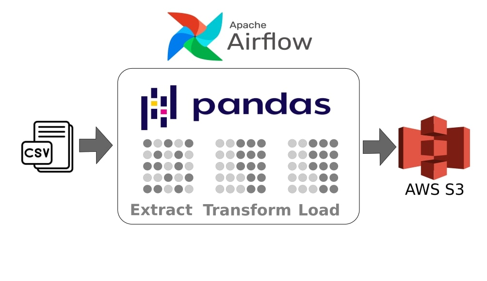

# airflow_csv_to_s3

# *Overview*
Project repo to conduct ETL automatically orchestration by Apache Airflow, this repo is about how to step-by-step conduct ETL using Airflow using CSV file as data source, data transformation (removing duplicates, removing missing value) in python code then transforming into AWS S3 cloud service.
# *Prerequisites*
To follow along this learning need to be available requirements:
- python3 installed
  ```bash
  sudo apt install python3
  ```
- Apache Airflow running with S3 setup
  ```bash
  airflow webserver --port 8080

  airflow scheduler
  ```
- pandas library
  ```bash
  pip install pandas
  ```
# *Project Flow*
Automate Data Ingestion csv into S3 AWS using Airflow:
1. Load necessary libs
   ```python3
   from airflow.decorators import dag, task
   from datetime import datetime, timedelta
   from airflow.providers.amazon.aws.hooks.s3 import S3Hook

   import pandas as pd
   ```
3. Provide -- file path, s3 connection id
   ```python3
   FILE_PATH = "/home/mulyo/Learning/ETL_CSV_To_PostrgeSQL/CO2 Emission Country.csv"

   AWS_CONN_ID = 's3_conn'
   ```
5. ETL flow -- data extraction -> data transformation -> load s3
   ```python3
   extracted_df = dataExtraction(FILE_PATH)
   transformed_df = dataTransformation(extracted_df)
   loadData(transformed_df, bucket_name="airflow-csv-upload")
   ```
